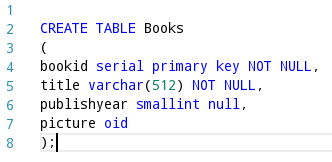
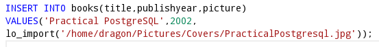
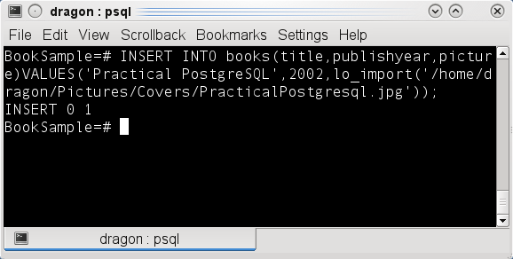
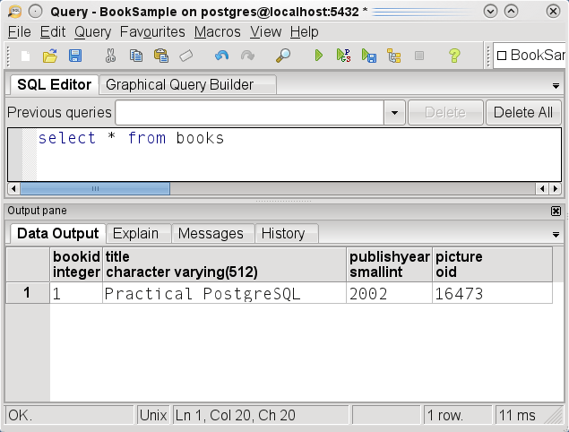
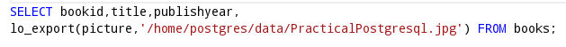
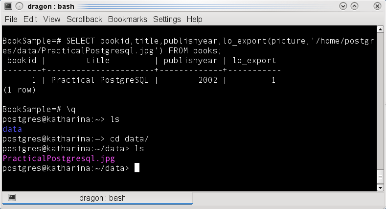

# Trabajando con tipos binarios BLOB (Binary Large Object ) en PostgreSQL.

En el estándar SQL  están definidos dos tipos de datos para guardar grandes cantidades de información, el CLOB (CHARACTER LARGE OBJECT) que se utiliza para información de tipo texto  y el BLOB (BINARY LARGE OBJECT).

El tipo de datos CLOB se representa en la base de datos como un registro con una gran cantidad de información de tipo carácter, estos caracteres pertenecen al conjunto de caracteres definidos por la base de datos (generalmente ASCII) siendo de un solo byte por lo que se utiliza para guardar archivos de texto como por ejemplo los archivos XML. Por su parte el tipo de datos BLOB se representa como un registro de una gran cantidad de información binaria sin estructura distribuida de forma aleatoria  por lo que es ideal para archivos binarios como los mapas, las gráficas, y todos los archivos multimedia.

<b>Trabajando tipos de datos BLOB con funciones predeterminadas de PostgreSQL</b>

<b>PostgreSQL</b> proporciona el soporte para tipos de datos BLOB mediante las funciones predeterminadas: <i>lo_import()</i> y <i>lo_export()</i>, las cuales importan y exportan archivos desde el sistema de archivos hacia la base de datos y viceversa.
Para ejemplificar el uso de estas funciones tenemos una tabla llamada Books con el siguiente script SQL:

 

Es esta tabla la columna picture tiene un tipo de dato oid el cual es un identificador que se utiliza como referencia hacia la tabla de sistema <i><b>pg_largeobject</b></i> la cual almacena el objeto binario en una o más filas, por lo que la columna picture almacena únicamente el apuntador hacia la información del objeto binario no el objeto binario en si.
Como ejemplo agregamos un registro a la tabla,  importando la imagen desde el sistema de archivos hacia la base de datos con la función: <i>lo_import()</i>

 

 

Ahora recuperamos el registro obteniendo la imagen desde la base de datos hacia el sistema de archivos con la función <i>lo_export()</i>.

 

Las funciones <i>lo_import()</i> y <i>lo_export()</i> son ejecutadas directamente por el servidor de PostgreSQL por lo que la ruta completa del archivo debe tener los permisos correspondientes para ser accesibles desde el servidor, es necesario que el usuario de PostgreSQL tenga el rol de <b>superuser</b> de PostgreSQL (no confundir con el root de Linux).

